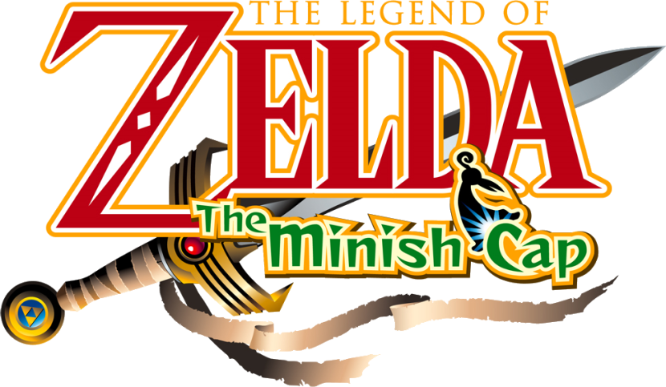
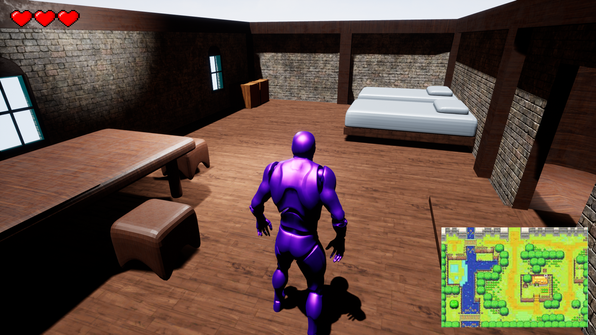
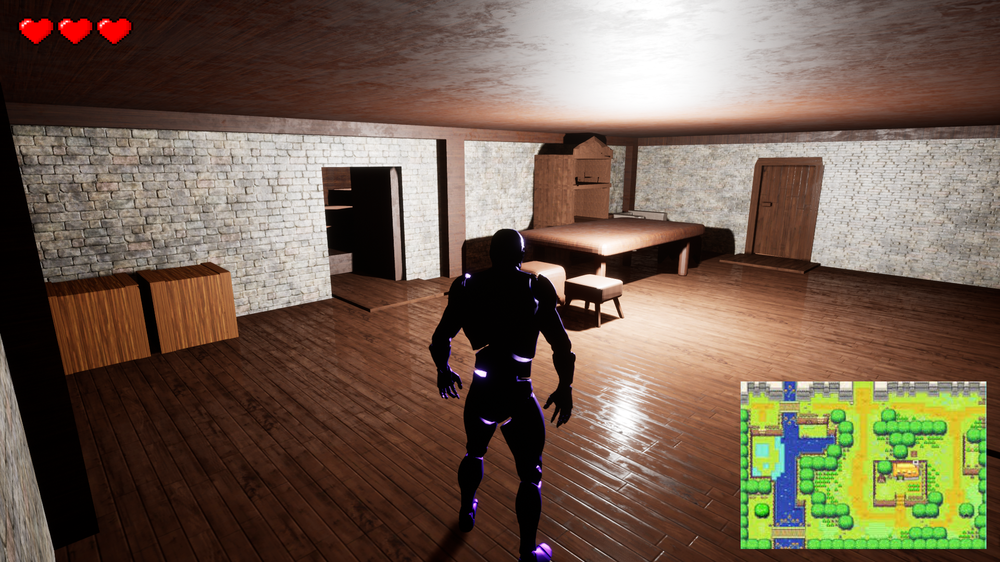
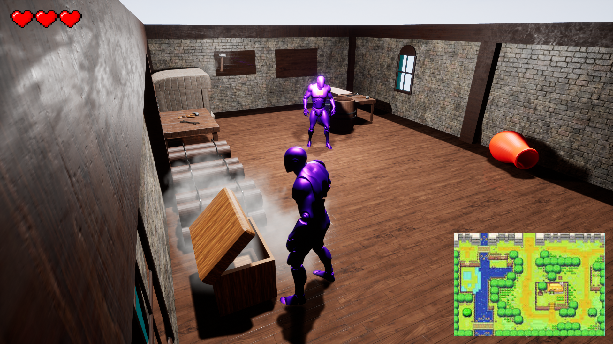
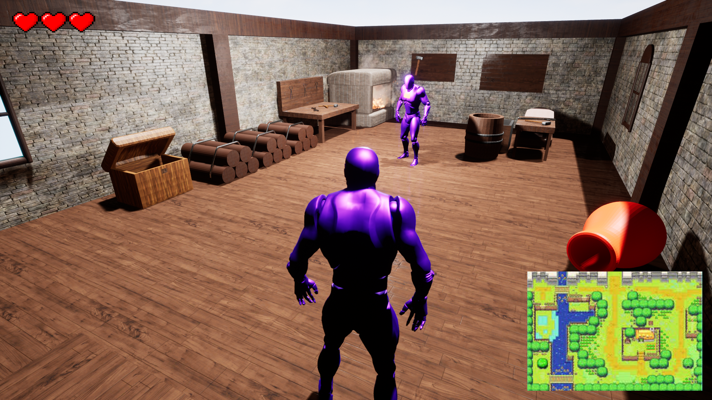
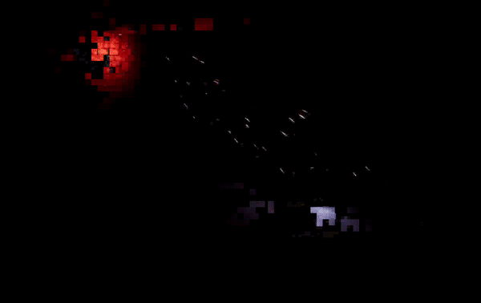

# Unreal-Zelda
Zelda minish cap's starting house.

This game is a 3D third person version of the GBA game zelda minish cap.

Since it is far too heavy (already more than 3 GB :o) it is impossible to add it on a github project
but I am currently working on a (free) way to download it from an other server.
This repository will just contain the informations about the future way to get the files.
If anybody wants to see some source code or 3D models (or soon, some music) just send me a mail (philippe.bouttereux@epitech.eu).

Here are also some pictures from the game:

(the main character is the base Unreal mannequin, but i already have the real models, i just need to create all animations)
